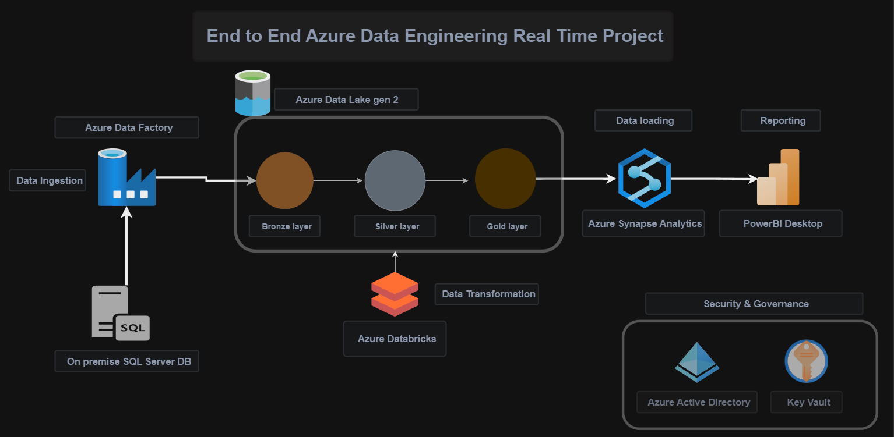

# Azure-Data-Engineering-projects

# End-to-End Azure Data Engineering Project

## Objective
The primary objective of this project is to demonstrate the implementation of an end-to-end data engineering pipeline using Azure services. The project aims to transform raw data from an on-premise SQL Server database into insightful visualizations in Power BI, ensuring secure and efficient data handling and processing throughout the pipeline.

## Stakeholders
- **Business Analysts**: Require accurate and timely reports for decision-making.
- **Data Engineers**: Need a robust and scalable data pipeline to handle increasing data volumes.
- **IT Security Team**: Ensures data security and compliance with organizational policies.
- **Executives**: Seek high-level insights to drive strategic initiatives.

## Business Problem
The organization faced challenges with data silos, slow and manual data processing, and limited visibility into key business metrics. There was a need for a streamlined, automated, and secure data pipeline to enhance data accessibility, reduce processing times, and provide actionable insights through interactive visualizations.

## Solution Overview
The solution leverages a suite of Azure services to create a seamless and automated data pipeline:

1. **On-Premise SQL Server DB**: The source of raw transactional data.
2. **Azure Data Factory**: Orchestrates data movement from the on-premise SQL Server to Azure Data Lake Gen2.
3. **Azure Data Lake Gen2**: Provides scalable and secure storage for raw and processed data.
4. **Azure Synapse Analytics**: Performs data transformation and aggregation to prepare the data for analysis.
5. **Databricks**: Facilitates advanced data processing and transformation tasks.
6. **Power BI**: Delivers interactive and insightful data visualizations to stakeholders.
7. **Azure Active Directory**: Manages user access and authentication to ensure security.
8. **Azure Key Vault**: Stores and manages sensitive information such as connection strings and passwords.

## Detailed Implementation
1. **Data Ingestion**: Azure Data Factory is used to periodically extract data from the on-premise SQL Server and load it into Azure Data Lake Gen2.
2. **Data Storage**: Raw data is stored in Azure Data Lake Gen2, which provides a scalable and secure storage solution.
3. **Data Processing**: Azure Synapse Analytics and Databricks are used to transform, clean, and aggregate the data.
   - **Azure Synapse Analytics**: Executes SQL-based transformations and aggregations.
   - **Databricks**: Handles more complex transformations and machine learning tasks.
4. **Data Visualization**: Processed data is loaded into Power BI for creating interactive dashboards and reports.
5. **Security and Compliance**: Azure Active Directory manages user authentication, and Azure Key Vault secures sensitive information.

## Results
- **Improved Data Accessibility**: Centralized data storage in Azure Data Lake Gen2 allows for easy access and processing.
- **Reduced Processing Time**: Automated data pipeline significantly reduces the time required to process and analyze data.
- **Enhanced Insights**: Interactive Power BI dashboards provide stakeholders with actionable insights, facilitating better decision-making.
- **Scalability and Flexibility**: Azure services offer scalable solutions to handle growing data volumes and changing business needs.
- **Robust Security**: Integration with Azure Active Directory and Azure Key Vault ensures data security and compliance.

## Conclusion
This project showcases the power of Azure's data engineering services to build a robust, scalable, and secure data pipeline. By leveraging these services, organizations can overcome data silos, automate data processing, and derive meaningful insights to drive business growth.

## Technologies Used
- On-Premise SQL Server
- Azure Data Factory
- Azure Data Lake Gen2
- Azure Synapse Analytics
- Databricks
- Power BI
- Azure Active Directory
- Azure Key Vault

